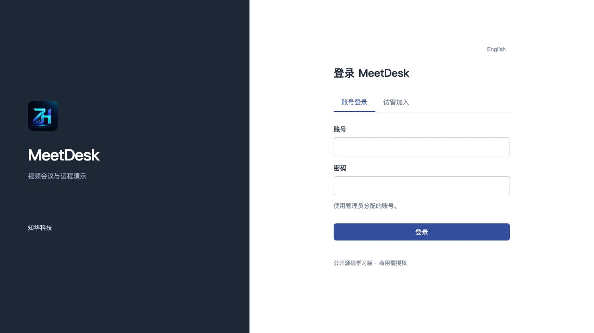
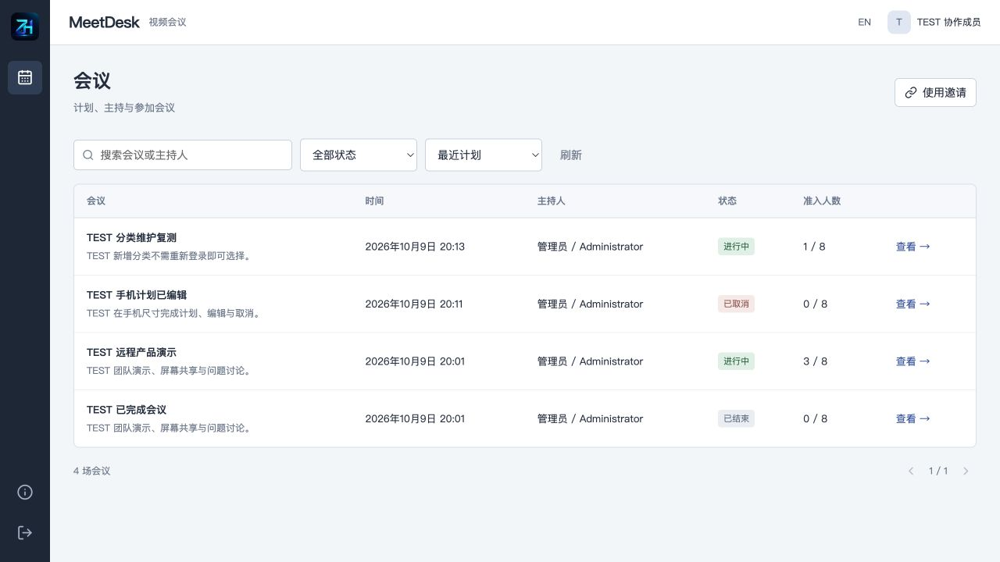
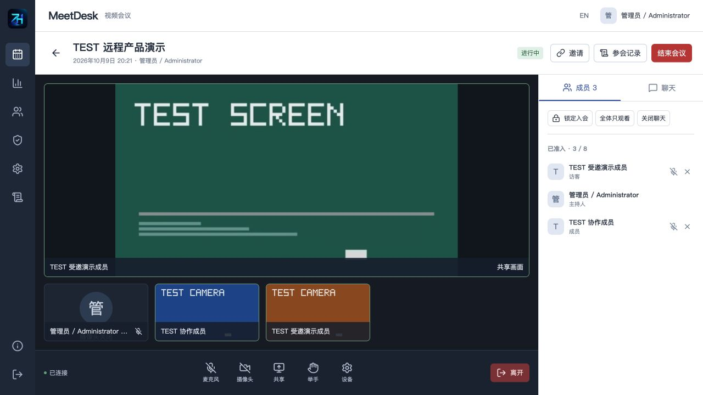
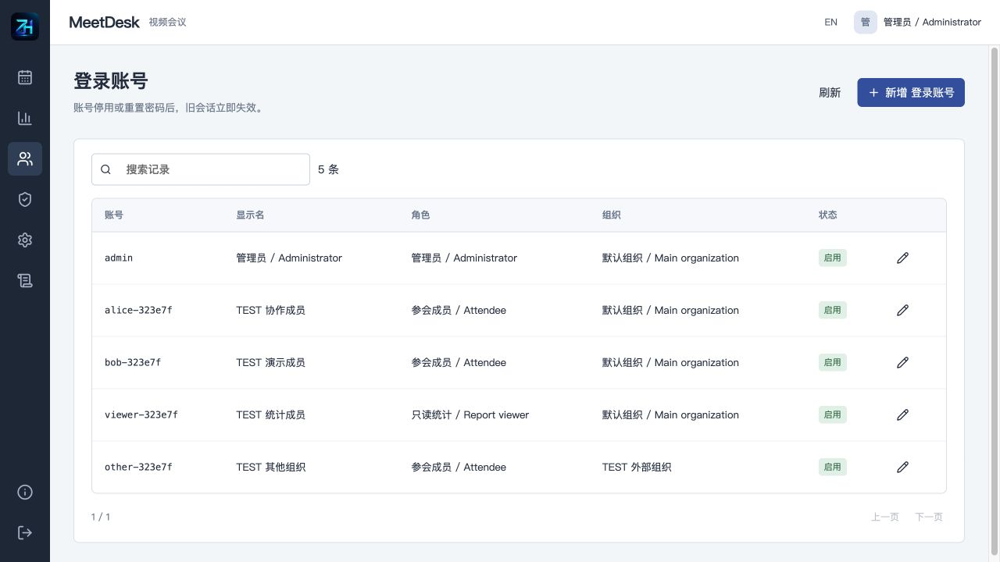
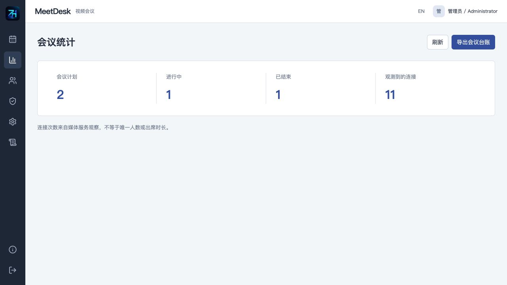
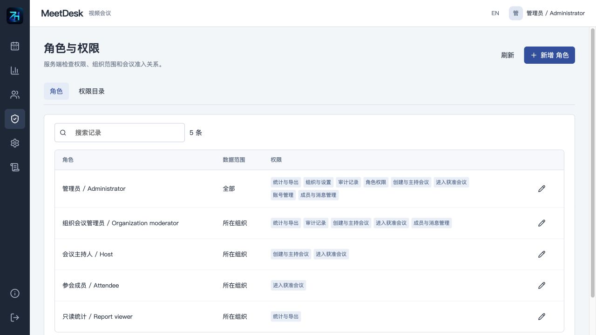
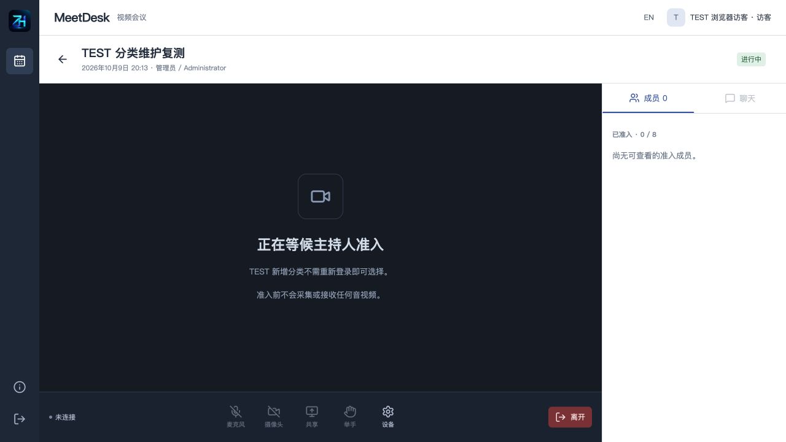

[中文](README.md) · [English](README.en.md)

# MeetDesk · 知华科技视频会议与远程演示系统

**知华科技（上海如静知华信息科技有限公司）** · [官网](https://www.zhuatech.cn/)

基于 Java 21、Spring Boot、Vue 3、MySQL 和 LiveKit 的自行部署视频会议源码。支持会议计划、访客等候室、音视频、屏幕共享、主持控制、聊天与实际接入记录。**公开源码学习版，仅限非商业使用，未经书面授权不得商用。**

适合学习和评估团队会议、远程产品演示、培训答疑等流程。组织账号可以管理和参加会议；外部访客通过限期、限次邀请申请入会，由主持人批准。访客无需新建正式账号，但填写的姓名不构成真实身份验证。

不提供公共会议运营服务，不需要付费模型或托管媒体账户。媒体服务随 Compose 自行部署；公网使用仍需配置可达地址、HTTPS 和媒体网络。

## 从计划到结束

1. 管理员创建组织、角色和账号，分配主持人或参会权限。
2. 主持人创建会议计划，设置分类、议程、时间、人数和时长；待开始的计划可以编辑或取消。
3. 主持人生成邀请。正式账号或外部访客申请后进入等候室；批准后才能读聊天、连接媒体。
4. 开始会议后，成员主动打开自己的麦克风、摄像头或屏幕共享。主持人可以锁定新入会、切换成员为观看模式、移出成员或关闭聊天。
5. 主持人结束会议，或达到时长上限后自动结束。原会议不能再次开启，媒体授权失效。
6. 查看参会连接记录、会议统计并导出会议台账。记录来自媒体服务观察，**领取接入票据不等于实际出席**。

## 已实现的页面与能力

| 模块 | 功能与边界 |
| --- | --- |
| 会议目录 | 搜索、状态筛选、排序、分页；计划创建、版本保护编辑、取消、开始和结束 |
| 用户会议端 | 本人入会、退出、举手、持久聊天及历史翻页、删除本人消息、音视频与无音频屏幕共享、设备选择、连接状态与接收统计 |
| 访客端 | 邀请有效期与使用次数、独立会话、等候室、仅访问受邀会议；批准前无聊天及媒体权限 |
| 主持端 | 批准、拒绝、移出；单人/全体观看模式、聊天开关、入会锁、邀请创建及撤销、实际连接记录 |
| 账号后台 | 登录、退出、BCrypt、账号新增/编辑/停用、密码重置、角色及接口权限、组织数据范围、菜单启停、分类字典、参数管理 |
| 统计与审计 | 会议状态和观察到的连接次数、CSV 台账、组织范围内操作记录；不导出聊天或邀请凭据 |
| 部署维护 | MySQL 持久卷、Flyway 迁移、健康检查、私有配置生成、一致性备份与独立实例恢复 |

同一成员同时只保留一个有效媒体连接；新连接会替换旧连接。观看模式限制麦克风、摄像头和共享发布，仍可观看与收听。主持人不能远程强制开启成员设备。撤销邀请阻止后续使用，移出成员需单独操作。

### 实际页面

截图使用明确标记的 TEST 测试资料；媒体画面为测试客户端经实际服务传输的合成摄像头和共享轨道，没有拍摄真实人员或桌面。

**登录：正式账号和受邀访客分开进入。**



**用户首页：会议目录、状态、人数和查询。**



**核心会议：摄像头、共享画面、成员和聊天。**



**后台：账号启停、组织与角色分配。**



**统计：实际观察连接与会议状态。**



**权限：角色能力与组织数据范围。**



**访客端：受邀申请后等待主持人批准，准入前不读取聊天或接收媒体。**



## 技术架构与目录

浏览器通过同源 Nginx 访问 Vue 页面和 Spring Boot API，业务数据写入 MySQL。媒体信令先经过后端准入鉴权，再代理至 LiveKit；媒体传输使用独立 ICE/TURN 端口。LiveKit 管理接口、数据库和后端端口不直接对外映射。

| 层 | 版本 |
| --- | --- |
| 后端 | Java 21、Spring Boot 4.0.7、Spring Security、JPA |
| 前端 | Vue 3.5.43、Vite 8.1.5、livekit-client 2.22.3、Node.js 24.19+ |
| 存储 | MySQL 8.4、Flyway，Hibernate 校验表结构 |
| 媒体 | LiveKit Server 1.13.9；WebRTC 摄像头、麦克风、屏幕共享 |
| 部署 | Docker Compose v2、Nginx 1.29 |

```text
backend/                         Java API、权限、准入和媒体巡检
  src/main/resources/db/migration/  V1 身份与目录、V2 会议业务
  src/test/                        集成与媒体协议单元测试
frontend/                        Vue 页面、实际媒体轨道、Nginx
scripts/                         配置、验收、媒体测试、备份恢复
compose.yaml                     四项服务和独立 MySQL 数据卷
.env.example                     配置名称与安全说明
runtime/                         私有媒体配置，禁止提交
README.md / README.en.md         中英文说明
docs/                            操作、部署、接口、许可与实际截图
```

## 安装、启动与数据库初始化

环境要求：Docker Engine / Desktop、Compose v2、Python 3.11+，建议 4 CPU、4 GB 以上可用内存。单独开发后端需要 Java 21、Maven 3.9+；前端需要 Node.js 24.19+ 和 npm。

```bash
git clone https://github.com/zhuatech-han/zhuatech-meetdesk.git
cd zhuatech-meetdesk
python3 scripts/init-env.py
docker compose -p meetdesk config --quiet
docker compose -p meetdesk up -d --build --wait --wait-timeout 240
```

打开 [本机页面](http://127.0.0.1:8131/)，健康检查为 [health](http://127.0.0.1:8131/health)。初始化账号为 `admin`，密码由脚本随机生成，**在本机私有 `.env` 的 `ADMIN_PASSWORD` 字段查看**，没有通用默认密码。不要把 `.env`、终端凭据或私有备份上传到 Git。

Flyway 首次在空库执行 `V1__identity.sql`、`V2__meetings.sql`，初始化组织、五类角色、菜单、字典和参数；管理员只在不存在时创建。正式启动不注入测试会议或参会者。默认数据库名 `zhuatech_meetdesk`，用户 `meetdesk`，独立 Compose 卷保存账号、会议、消息、邀请摘要与媒体连接记录。

升级前备份，然后使用相同项目名更新镜像并启动；Flyway 自动校验和执行新迁移。不要修改已执行迁移的内容，不要将 `down -v` 用在需要保留的数据上。初始化密码环境变量不会覆盖已有账号密码。

开发运行和独立恢复见 [部署说明](docs/DEPLOY.md)。

## 配置

| 变量 | 含义 |
| --- | --- |
| `MYSQL_ROOT_PASSWORD` / `DATABASE_PASSWORD` | 独立数据库凭据，脚本随机生成 |
| `ADMIN_USERNAME` / `ADMIN_PASSWORD` | 首次管理员账号及强密码 |
| `LIVEKIT_API_KEY` / `LIVEKIT_API_SECRET` | 后端与自有媒体服务一致的凭据；不是公共客户端密钥 |
| `WEB_PORT` / `BIND_ADDRESS` | 网页入口，默认 8131 / 127.0.0.1 |
| `RTC_BIND_ADDRESS` / `RTC_NODE_IP` | 媒体端口绑定地址及客户端可达媒体 IP |
| `RTC_TCP_PORT` / `RTC_UDP_PORT` | 媒体 TCP / UDP，默认 7921 / 7922 |
| `TURN_UDP_PORT` | TURN UDP，默认 7923 |
| `TURN_RELAY_START` / `TURN_RELAY_END` | TURN relay UDP 范围，默认 7930–7940 |
| `LIVEKIT_CONFIG_PATH` | `runtime/` 内私有媒体配置路径 |
| `COOKIE_SECURE` | HTTPS 部署设为 true；本机 HTTP 测试默认 false |

端口冲突可以在 `.env` 修改，媒体端口及地址修改后运行 `python3 scripts/init-env.py --render` 重新生成配置。该操作会覆盖媒体配置，先保存手工配置；不带 `--render` 时保留已有配置。

后台参数：默认人数上限 16、时长上限 120 分钟、邀请有效期 24 小时、消息长度 2000。可配置范围分别为 2–32、15–480 分钟、1–720 小时、100–4000 字。人数上限是准入限制，不是已完成的负载验证。

## 测试方式

```bash
# 后端：格式检查、全部单元/集成测试和打包
cd backend
mvn -B spotless:check test package
cd ../frontend
npm ci
npm run format:check
npm run lint
npm test
npm run build
cd ..
python3 scripts/test-config.py
docker compose -p meetdesk config --quiet
git diff --check
```

实际部署验收脚本只对**全新、可丢弃的测试实例**运行，会创建 TEST 账号和业务记录：

```bash
python3 -m venv .venv-quality
.venv-quality/bin/pip install -r scripts/requirements-quality.txt
.venv-quality/bin/python scripts/quality.py
.venv-quality/bin/python scripts/verify-media.py
```

验收状态写入忽略的 `private-*.json`，其中含测试会话信息，禁止上传。媒体验收使用两个独立客户端发送不同频率语音、摄像头和屏幕轨道，校验接收音频频率与解码画面；不访问物理麦克风、摄像头或桌面。短媒体验收会移出测试访客，再次运行需要新访客；长时间测试也需先准备有效测试身份。测试细节见 [测试与限制](docs/TESTING.md)。

## 部署、安全与常见问题

- 本机 `127.0.0.1` 只适合同机测试；外部设备必须使用可达的媒体 IP 和网页入口。正式网络配置由部署者完成。
- 非 localhost 的麦克风、摄像头和共享需要 HTTPS；网页代理要支持 WebSocket，媒体 TCP/UDP/TURN 也要可达。
- 已登录但不能连接，先检查会议是否进行中、是否准入、观看模式、票据撤销和媒体端口；连接错误不等于聊天权限已失效。
- 没声音时检查设备、浏览器播放限制和观看权限；页面提供恢复播放入口。共享不包含系统音频。
- 账号及访客 HTTP 会话保存在单个后端实例内存中，重启后需重新登录或重新使用有效邀请；业务数据仍持久保存。
- CSRF、组织范围和服务端权限用于请求校验；密码重置、账号停用或角色权限撤销、退出、移出和结束会撤销媒体资格。媒体巡检约两秒执行一次，故障期间会重试，不能承诺即时硬断开。
- 邀请代码只在创建时显示，数据库只存摘要；仍需保护分享链接。聊天是普通服务端持久化内容，没有端到端加密。
- 不开放 LiveKit 管理端口，不打印原始媒体凭据。请同时保护反向代理及基础设施日志、SQL 备份和环境文件。

## 已知限制

单后端、单媒体节点；目录查询最多 10000 条，搜索和分页在前端处理，大规模服务端分页和归档未实现。没有集群、负载测试、32 人并发验收、真实摄像头/麦克风采集、多系统浏览器兼容或跨公网弱网验收。没有录像、会议回放、转写、AI 纪要、PSTN、系统音频共享、文件上传、SSO、业务系统嵌入或支付。默认禁止跨站 iframe。会议结束后聊天不再对客户端开放；已有消息仍在数据库内，按部署者的数据保留规则处理。

源码可以构建部署及验证所列流程，**不能将本地测试结果视为生产可用承诺**。企业交付需完成目标设备、网络、容量、安全和备份演练，并取得商业授权。

## 授权、贡献与反馈

自有代码以根目录 [LICENSE](LICENSE) 为准：仅限个人学习、技术研究与非商业交流，未经上海如静知华信息科技有限公司书面授权不得商用。不是允许免费商用的 MIT/Apache 项目，也不是 OSI 标准开源许可。第三方组件保留各自版权和许可，见 [第三方说明](docs/THIRD_PARTY.md)。

问题反馈请提供版本、脱敏复现步骤和预期结果；不要在公开 Issue 上传密码、邀请、Cookie、客户资料或 SQL。欢迎有测试和说明的小范围改进；安全漏洞请私下联系知华科技。软件按现状提供，免责声明见 LICENSE。

## 联系知华科技

商业授权或深度定制开发请联系知华科技。服务包括商业源码授权、软件定制、部署和系统集成。

本项目由知华科技（上海如静知华信息科技有限公司）提供公开源码学习版本，主要用于个人学习、技术研究与非商业交流。未经书面授权不得商用。企业信息化建设、中小企业数字化转型、中小企业 AI 转型、私有化部署、软件外包、软件项目外包、软件实施、FDE 外包、OPC 技术支持及深度定制开发，请访问知华科技官网 [https://www.zhuatech.cn/](https://www.zhuatech.cn/)，或添加微信 zhuatech、zhuatech2 咨询。

<table>
<tr>
<td align="center" width="50%"><br>微信：zhuatech</td>
<td align="center" width="50%"><br>微信：zhuatech2</td>
</tr>
</table>
